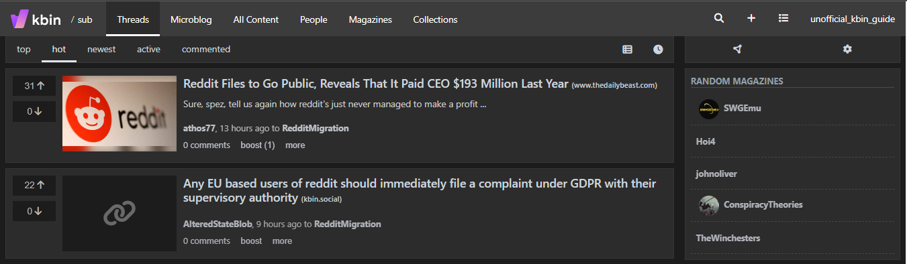
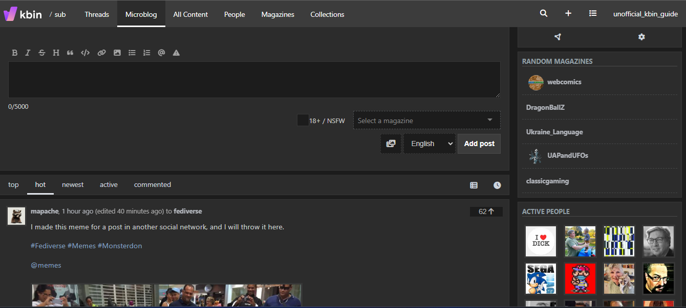
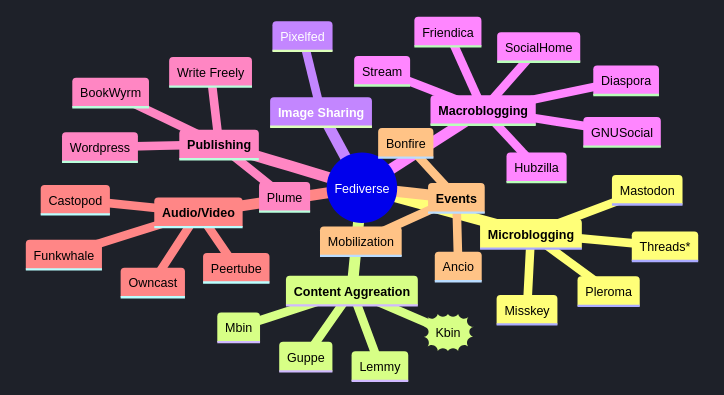

# Welcome

## Introduction to /kbin

Welcome to the ***unofficial*** guide to /kbin. /kbin is a social media platform that allows people to create microblogging content and long-form content from a single spot. Want to send a quick message out to your followers? You can do it on /kbin. Want to share a news link and discuss it in a forum? You can do it on /kbin. Want to share your art with the world? You can do it on /kbin.

With /kbin, you can stay connected with friends, family, and others by posting short, frequent messages directly to them. Or, they can "follow you" and get those posts directly in their channel. Moreover, in /kbin, you can follow any number of Magazines to find others who are looking to discuss your interests, hobbies, or anything else in more detail. Don't see a Magazine for something you are passionate about? Then, become the editor of your own Magazine and get the discussion started!

Guess what? These activities are not confined to /kbin. It is up to you. You can choose to interact with only those on your /kbin instance or reach out and have these discussions on the broader fediverse.

!!! info "For more information about the Fediverse, see the [Fediverse Wikipedia page](https://en.wikipedia.org/wiki/Fediverse)."

The creators and developers of /kbin describe it as[^1]:

> /kbin is a modular, decentralized content aggregator and microblogging platform running on the Fediverse network. It can communicate with many other ActivityPub services, including Mastodon, Lemmy, Pleroma, Peertube.
>
> The initiative aims to promote a free and open internet.
> 

[^1]: **Source:** [/kbin Codeberg Repo](https://codeberg.org/Kbin/kbin-core/wiki/Introduction). Note: the /kbin project is no longer available or in active development.

## About this Guide

This guide will help you get started with /kbin and learn to navigate the platform. However, if you are looking for more information on creating your own /kbin instance or contributing code, see the [/kbin Wiki](https://codeberg.org/Kbin/kbin-core/wiki/).

!!! warning "The /kbin project is no longer available or in active development."

!!! question "Why is this guide "unofficial?""
    This is information that I have aggregated across /kbin. I have created this guide as a hobby and am not affiliated with the project or part of the /kbin development team.

This guide uses `kbin.social` in its examples, but these instructions should work for any /kbin instance.

## Let's Get started

Ready to join /kbin? Then, review the **Create an Account** page to learn how to create an account and get started!