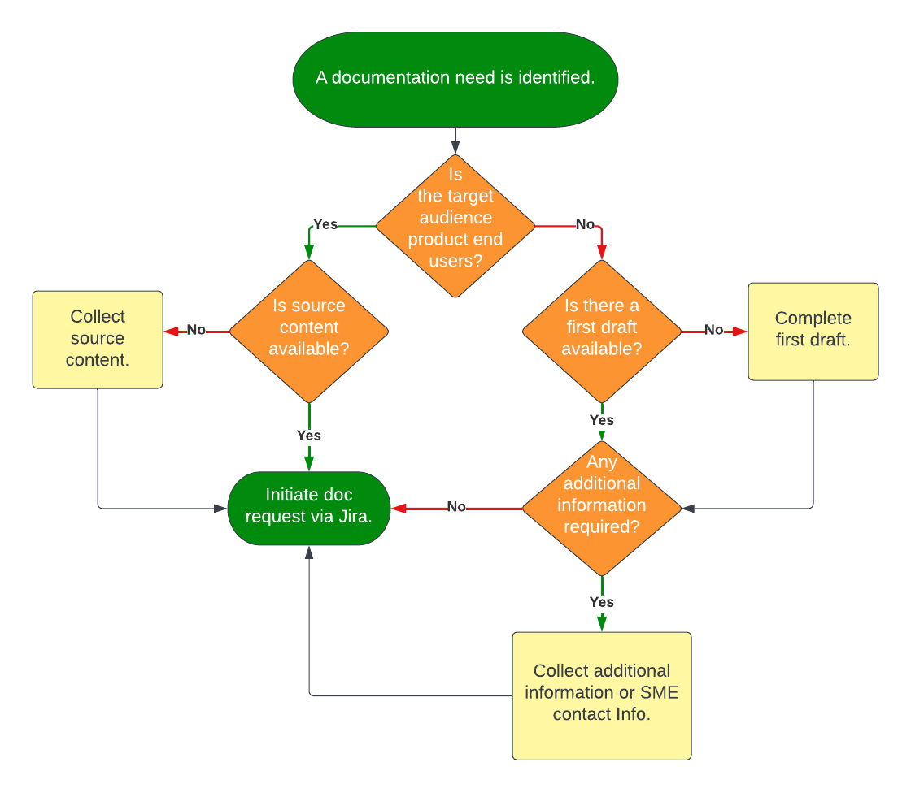

!!! Info
    This is a sample documentation request process document that internal business units would use to request documentation support from the technical writing staff.

## Overview

The documentation team uses a Jira-based (Kanban) workflow to fulfill documentation requests. Review this document to determine when and how to create a request.

## When to Make a Request

The primary role of the documentation team is to create external documentation to support product users. This support includes the creation of new documentation and the maintenance of existing documentation. However, the documentation team also provides editorial reviews of internal documentation. The following diagram helps to determine if your team should engage the documentation team.

## How to Make a Request

Once you have determined that documentation team support is needed, use the following steps to create a documentation request:

1. Go to the **Doc Team** project in Jira.
2. In Jira, click **Create**.
3. On the *Create Issue* screen, complete the fields as follows:
    - **Summary** - Enter a short title for the request.
    - **Issue Type** - Select **Story**.
    - **Description** - Provide details about the documentation being requested. Include contact information for subject matter experts.
    - **Acceptance Criteria** - Enter the type of document being requested as well as where to publish.

4. Once the fields are complete, click **Create** on the *Create Issue* screen.
5. Once the request is created, it is added to the documentation team's backlog. The team will review the request and reach out to the Reporter or the subject matter expert identified in the request to begin work.

