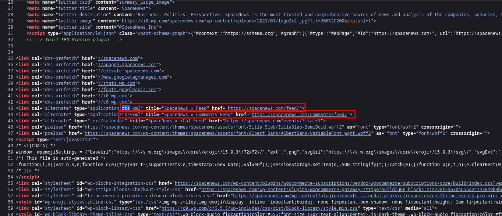
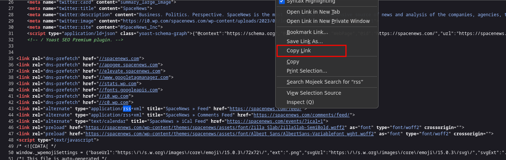

# How to find an RSS URL by Viewing Page Source?

If you are having trouble finding the RSS Feed URL for a site, try viewing the page source. This post will walk you through a quick way to see if a site publishes an RSS or Atom feed by viewing the page source. Don't worry, it is not as technical as it sounds.

1. Go to a website you are interested in using your favorite web browser.
   
2. On the webpage, right-click to get the menu and click **View Page Source**. On mobile devices, add `view-source:` in front of the URL.
   
3. On the **Page Source**, open the **Find** menu. Also, ++ctrl+f++ is normally the shortcut for find.
   
4. In the **Find** field, enter `rss`. If nothing is found for `rss`, try `atom` as some sites prefer Atom feeds. Your feed reader should be able to subscribe to both Atom and RSS feeds. 
   
5. In the source, find the highlighted `rss` entries. Following the rss entry, there will be a feed url.
   
6. Copy that url and paste it into your feed reader's subscribe field.
   
7. Once subscribed, your feed reader will load the site's feeds.
   

